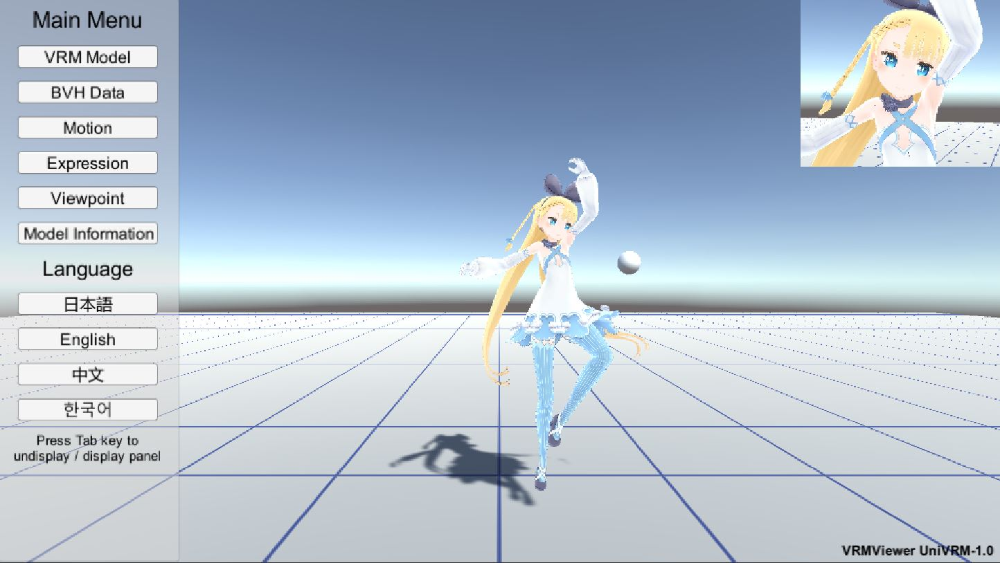

# VRMViewer

An application that users can view VRM models based on [UniVRM_1_0](https://github.com/vrm-c/UniVRM_1_0).  

ユーザーが[UniVRM_1_0](https://github.com/vrm-c/UniVRM_1_0)に基づくVRMモデル情報を確認できるアプリケーションです。

# License

The project is released under the [MIT License](License.txt).

このプロジェクトのライセンスは[MIT License](License.txt)です。

## API Update in VRMViewer (UniVRM 0.x -> 1.x)

* VRM Meta: `VRMImporterContext.ReadMeta(true)` -> `VrmLib.Model.VRM.Meta`
* LookAt: `VRMLookAtBoneApplyer`, `VRMLookAtBlendShapeApplyer`, `VRMLookAtHead` -> `VRMBlendShapeProxy`
* `VRMLookAtHead.Target` -> `VRMBlendShapeProxy.Gaze`
* `VRMBlendShapeProxy.ImmediatelySetValue` -> `VRMBlendShapeProxy.SetValue`, `VRMBlendShapeProxy.SetPresetValue`

## ToDo

* [x] モデル情報表示 (Model information)
* [x] コマンドライン引数 (Command line arguments)
* [x] T-Pose・モーションスイッチ (T-Pose / Motion switch)
* [x] 目線・正面・ターゲット・カメラ目線 (The model looks straight ahead / looks at target / looks at camera)
    * [x] VRMBlendShapeProxy.LookAtTypes.Bone
    * [x] VRMBlendShapeProxy.LookAtTypes.BlendShape
* [ ] BlendShape
    * [x] Aa-Ih-Ou-Ee-Oh
    * [x] AutoBlink 
    * [ ] Next, Prev
* [x] 表情リスト (Expression list)
* [x] 一人称表示 (Model rendering in first-person mode)
* [ ] 頂点数 (Vertex count)
